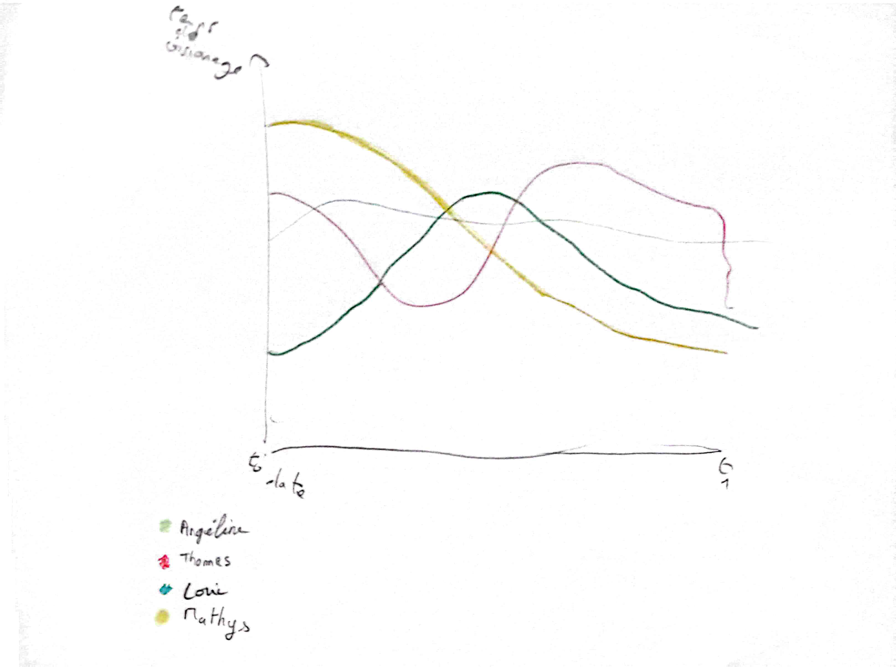

# Séance du 3 décembre 2024

## Sujet

Après avoir discuté entre nous, nous avons choisi de réaliser une **visualisation de nos données personnelles de la plateforme YouTube**.

## Contexte

Nous avons commencé par définir 10 questions au format *"Comment pourrait-on ?"* pour nous aider à définir les axes de notre projet :

- Comment peut-on voir l'évolution de ce que l'on regarde ?
- Comment peut-on voir l'évolution du temps qu'on passe sur YouTube ?
- Il y a-t-il une corrélation entre type de vidéo et moment de la journée ?
- Est-ce qu'on regarde le même type de contenu ?
- Existe-t-il une différence entre les jours de la semaine en terme de temps passé ?
- Existe-t-il une différence entre les jours de la semaine en terme de type de contenu regardé ?
- Quel est le temps moyen que l'on passe sur YouTube (jour, semaine, mois...) ?
- Quel est le temps moyen des vidéos que l'on regarde ?
- D'où viennent les vidéos que l'on regarde ?
- Quel est le nombre moyen d'abonnés des chaînes que l'on regarde ?

Suite à cela, chacun a voté pour les trois questions qui lui semblaient les plus pertinentes. Les questions qui ont obtenues le plus de votes sont les deux premières :
1. Comment peut-on voir l'évolution de ce que l'on regarde ?
2. Comment peut-on voir l'évolution du temps qu'on passe sur YouTube ?

## Brainstorming

A partir de ces questions précédemment citées, nous avons échangé et décidé de sélectionner la première question car elle est plutôt générale et nous permettra de visualiser plusieurs aspects de notre utilisation de YouTube.

Nous avons ensuite pris des feuilles et avons réalisé des esquisses de graphiques pour répondre à cette question.
 

*
Figure 1 : Graphique linéaire qui montre l'évolution du temps de visionnage au fil du temps
*

*Ajouter ici les autres esquisses réalisées*

## Crazy 8's

Nous avons enfin utilisé nos différentes idées pour réaliser un Crazy 8's chacun. Avec un stylo et des crayons de couleur, nous avons dessiné des graphiques en barres, des graphiques linéaires, des graphiques circulaires, des cartes, des heatmaps ou encore des tableaux. Le travail n'étant pas terminé, nous avons convenu de le finir pour la prochaine séance.

## Travail à faire pour la prochaine séance

- [X] Terminer les crazy 8's
- [X] Réaliser le document de cadrage
- [X] Commencer à s'intéresser à la récupération des données