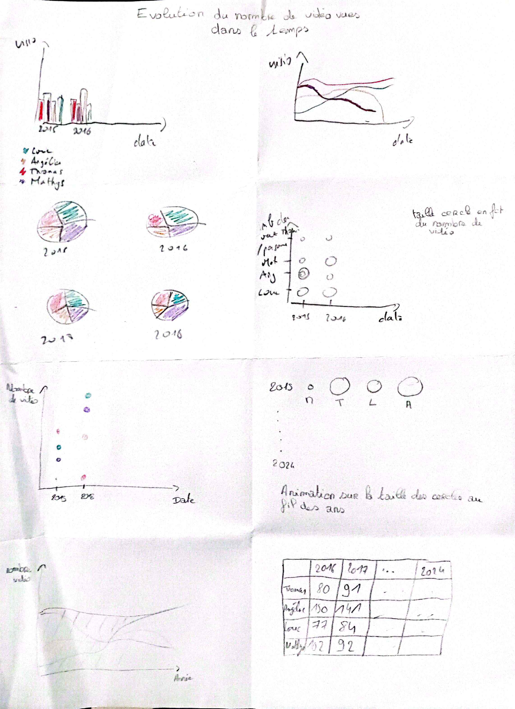
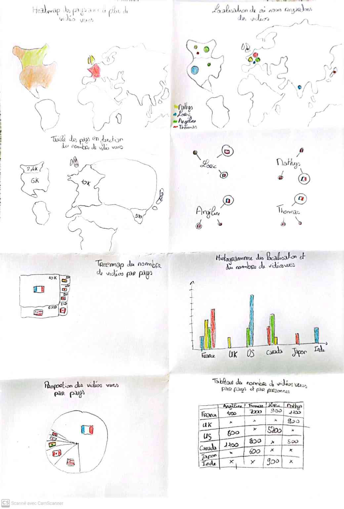
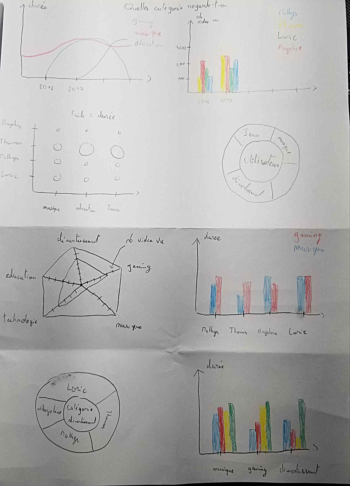
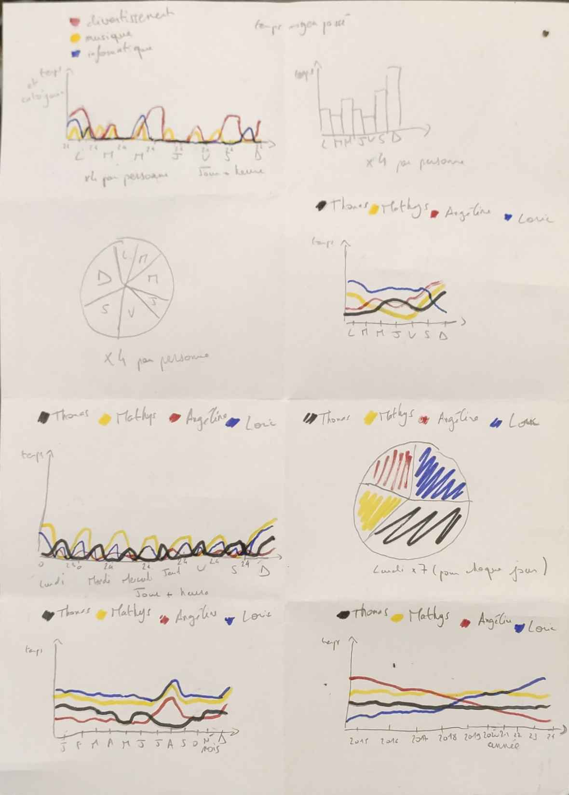

# Séance du 17 décembre 2024

## Récapitulatif de l'avancement

### Tâches réalisées : 

* Création du répertoire GitHub
* Rédaction du document de cadrage
* Finition des crazy 8's
* Démarrage de la rédaction des fichiers d'avancement de séance
* Récupération des données personnelles du groupe
* Recherches sur les moyens de récupération des données de l'API

### Crazy 8's 


*<p align="center">Figure 1 : Crazy 8's lié à l'évolution du nombre de vidéos vues dans le temps</p>*


*<p align="center">Figure 2 : Crazy 8's lié à la localisation des vidéos visionnées</p>*


*<p align="center">Figure 3 : Crazy 8's lié aux catégories regardées par chacun</p>*


*<p align="center">Figure 4 : Crazy 8's lié à la temporalité des vidéos visionnées</p>*

## Répartition du travail pour la séance

### Scrapping des données

Nous avons chacun récupéré nos données personnelles grâce à l'outil Takeout de Google mais celui-ci ne nous donne pour notre historique que les liens de la vidéo et le moment où elle a été visionnée. Afin de récupérer les informations nécessaires pour notre projet, nous avons décidé de **scraper les données** de YouTube.

<u>Angéline</u>, qui avait commencé à travailler sur ce point, s'est occupé de cette tâche en utilisant Selenium. Elle est parvenue à extraire la majorité des informations telles que le titre de la vidéo, la chaîne, la durée ou encore la catégorie. Quelques problèmes subsistent encore mais une grande partie du travail est faite.

### Début de la visualisation

#### Type de données

Même si nous n'avions pas encore les données complètes, nous avons commencé à travailler sur la visualisation avec des données fictives fournies par ChatGPT. Voici un exemple de vidéo fictive :

```json
{
        "id": 1,
        "date": "2024-12-15",
        "heure": "18:30",
        "titre": "Comment cuisiner des pâtes maison",
        "duree": "00:12:45",
        "chaine": "Recettes faciles",
        "tag": ["cuisine"],
        "genre": "Éducation",
        "pays": "France"
    }
```

#### Répartition des tâches

Nous nous sommes lancés dans la création des graphiques à partir des crazy 8's réalisés lors de la séance précédente.

- <u>Loric</u> a démarré par la réalisation d'un graphique en barres qui exprime la **durée de visionnage de chacun en fonction du temps**.
- <u>Mathys</u>, quant à lui, a aussi commencé un graphique en barres traitant des **catégories en fonction du temps**.
- Enfin de son côté, <u>Thomas</u> s'est occupé de **l'évolution du nombre de vidéos vues dans le temps**.

## Tâches à réaliser pour la prochaine séance

- [X] Finaliser le scraping des données
- [ ] Continuer la visualisation des données
- [ ] Commencer le quatrième graphique sur la localisation des vidéos visionnées 